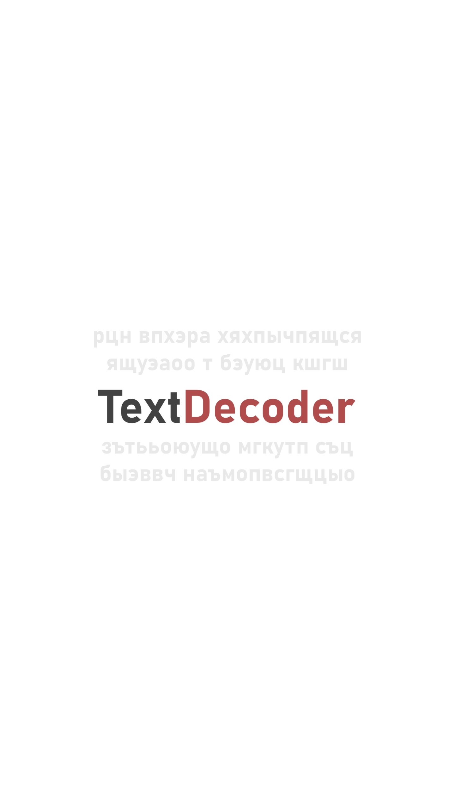
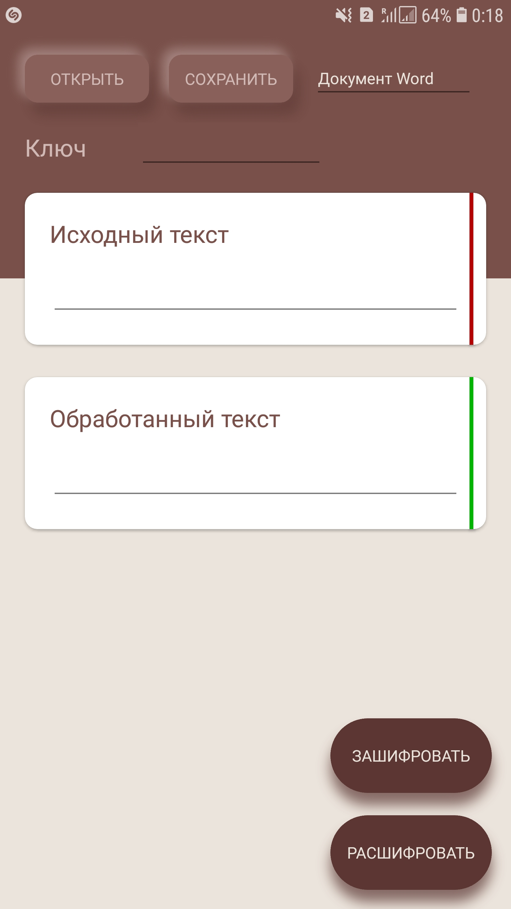
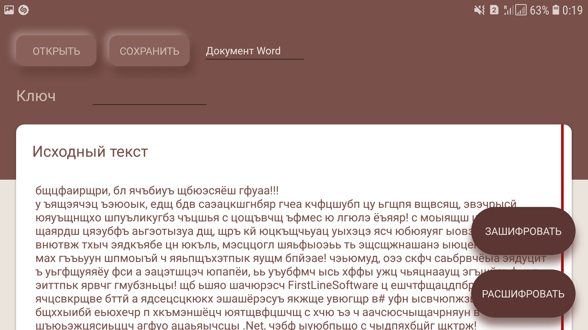

# CrossTextDecoder
ver 1.0.2

## Курсовой проект

## Введение
На сегодняшний день сфера IT индустрии активно развивается, количество технологий и платформ с каждым годом становится все больше. И поэтому, чтобы разрабатываемый программный продукт охватил наиболее широкий спектр  платформ и устройств, ему необходимо в первую очередь стать кроссплатформенным.
В качестве фреймворка для реализации проекта было принято решение исполььзовать **Xamarin** и **.Net Core**.
Полученный продукт охватывает системы **Android 5.0+** и **Windows UWP**.

## Реализация
В качестве паттерна проектирования был использован **MVVM**.  
Тестирование проходило с помощью **MSTest**.  
Были использованы следующие библиотеки:
- Xamarin.Forms
- NETStandard.Library
- ntics - для получения кодировки ANSI на отличных от windows платформах
- Xamarin.Essentials
- Syncfusion.DocIO.Net.Core - Для работы с документами Word
- Sharpnado.Shadows - для возможности добавления теней в интерфейс
### UML диаграмма

### Структура проекта
- Headers
  - EncodingType - определение кодировки текстового файла. Поддержиается
    - ANSI **(на Android только в режимк Debug)**
    - UTF-8
    - Unicode
    - ASCII
- Interfaces
  - IFileDialog - необходим для вызова диалогового окна соткрытия/сохранения файлов. Реализация независима на каждой платформе
  - IReadable - интерфейс чтения и записи файлов
- Models
  - DataFileDialogModel - необходима для стандартизации общения диалоговых окон открытия и сохранения файлов. хранит в себе свойства, отвечающие за:
    - имя файла
    - короткий файла
    - длинный формат файла 
  - DataFileModel - формат для передачи файлов, имеет свойства:
    - тип файла
    - имя файла
    - файл в байтовом представлении
  - DataModel - модель данных для шифрования
- Utils
  - EncryptorText - отвечает за шифрование и расшифровку текста
  - ReaderText - отвечает за чтение текстовых файлов
  - ReadWord - отвечает за чтение файлов MS Word пакета Office
- ViewModels
  - BaseViewModel - базовый класс ViewModel
  - DecoderViewModel - отвечает за логику работы приложения, связывает представление с моделью
  - LoadingPageViewModel - всплывающие окна уведомлений
- Views
  - DecoderView - пользовательский интерфейс приложения
  - LoadingPage - пользовательский интерфейс всплывающих окон с уведомлениями  
  
На каждых из платформ (Android, UWP) были созданы реализации IFileDialog, учитывающие специфику работы платформ.  
### Функционал
Приложение позволяет выполнять следующие операции над текстом:
- Шифрование методом Виженера
- Расшифровка методом Виженера  
  
Пользователю предоставлен выбор:
- Открытие текстовых (.txt) и офисных (.docx) документов
- Сохранение текстовых (.txt) и офисных (.docx) документов
- Ввод с клавиатуры

## Обработка ошибок
Благодаря тестированию был выявлен широкий ряд возможных исключений при работе приложения. Основным фактором возникновения исключений оказался пользователь.  
Были обработаны следующие исключения:
- Открытие неподдерживаемых форматов
- Исключения, связанные с вводом выводом
- Валидация полей ввода

## Интерфейс
Интуитивно понятны и облегченный. Визуальный ряд был создан на основе неоморфизма.  
С помощью асинхронных операций удалось добиться плавной работы интерфейса .

</td>
</td>
</td>
